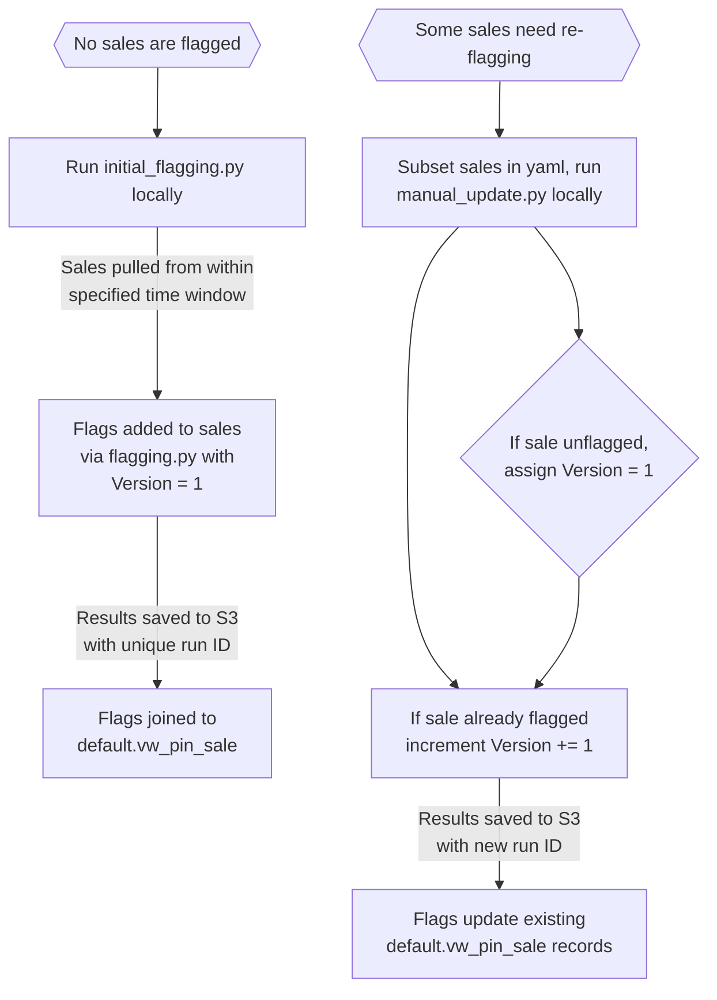
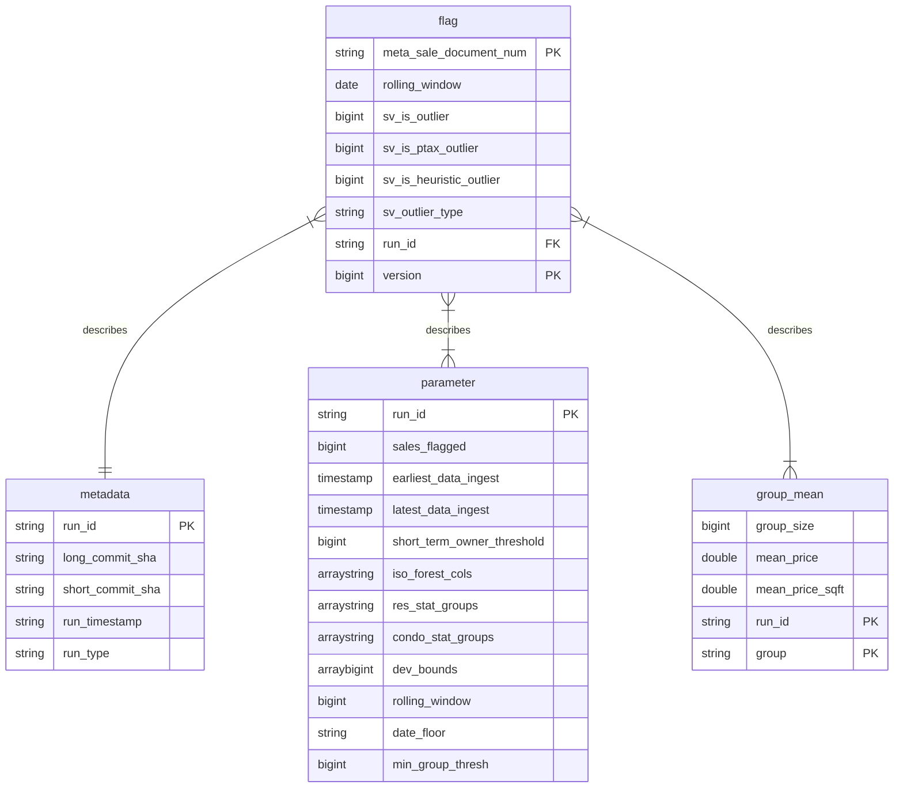

# Sales validation model (work in progress)

> :exclamation: IMPORTANT: This repo is under active development and is not yet in production.
>
> If an edit needs to made to anything in the `glue` directory, there is a specific process to be found [here](#aws-glue-job-documentation).

Table of Contents
================

- [Overview](#overview)
- [Structure of data](#structure-of-data)
- [Important flagging details](#important-flagging-details)
- [AWS Glue job documentation](#aws-glue-job-documentation)

# Overview

This repository contains code to identify and flag sales that may be non-arms-length transactions. A non-arms-length sale occurs when the buyer and seller have a relationship that might influence the transaction price, leading to a sale that doesn't reflect the true market value of the property. These sales can distort our analyses and models, since they don't adhere to the principle of an open and competitive market.

The workflow for sale flagging is as follows:

* A manual initial run of `manual_flagging/initial_flagging.py` instantiates all tables and flags all specified sales as either outliers or non-outliers.
* Next, `glue/sales_val_flagging.py` flags all new, unflagged sales. This script is automated such that it runs on a schedule (e.g. monthly).
* If an error occurs or we want to update the methodology on previously-flagged sales, `manual_flagging/manual_update.py` is used to select a subset of sales to re-flag. All sales have a version number that is incremented on update. When utilizing our sales views, we pull the flag data with the highest version value to keep it up-to-date.

On the left, we see the normal workflow of the process. Represented on the right is the use of `manual_update.py` to update/re-flag sales.

# Structure of data

All flagging runs populate 3 Athena tables with metadata, flag results, and other information. These tables can be used to determine _why_ an individual sale was flagged as an outlier. The structure of the tables is:

# Important flagging details

### Rolling window

The flagging model uses group means to determine the statistical deviation of sales, and flags them beyond a certain threshold. Group means are constructed using a rolling window strategy.

The current implementation uses a 12 month rolling window. This means that for any sale, the "group" contains all sales within the same month, along with all sales from the previous 11 months. This 12 month window can be changed by editing the config files: `manual_flagging/yaml/` and `glue/sales_val_flagging.json`. Additional notes on the rolling window implementation:

- We take every sale in the same month of the sale date, along with all sale data from the previous N months. This window contains roughly 1 year of data.
- This process starts with an `.explode()` call. Example [here](https://github.com/ccao-data/model-sales-val/blob/283a1403545019be135b4b9dbc67d86dabb278f4/glue/sales_val_flagging.py#L15).
- It ends by subsetting to the `original_observation` data. Example [here](https://github.com/ccao-data/model-sales-val/blob/499f9e31c92882312051837f35455d078d2507ee/glue/sales_val_flagging.py#L57).
- Corresponding functions in [Mansueto](https://miurban.uchicago.edu/)'s flagging model accommodate this rolling window integration, these functions are defined in each of the flagging functions, one in `manual_flagging/src/flagging_rolling.py`, and one for the Glue job in `glue/flagging_script_glue/*.py`.

# AWS Glue job documentation

This repository manages the configurations, scripts, and details for an AWS Glue Job. It's essential to maintain consistency and version control for all changes related to the job. Therefore, specific procedures have been established.

## ⚠️ Important guidelines

1. **DO NOT** modify the Glue job script, its associated flagging python script, or any of its job details directly via the AWS Console.
2. All changes to these components should originate from this repository. This ensures that every modification is tracked and version-controlled.
3. The **only** advisable actions in the AWS Console concerning this Glue job are:
    - Running the job
4. To test a change to the Glue job script or the flagging script, make an edit on a branch and open a pull request. Our GitHub Actions configuration will deploy a staging version of your job, named `sales_val_flagging_<your_branch_name>`, that you can run to test your changes. See the [Modifying the Glue job](#modifying-the-glue-job-its-flagging-script-or-its-settings) section below for more details.

## Modifying the Glue job, its flagging script, or its settings

The Glue job and its flagging script are written in Python, while the job details and settings are defined in a [Terraform](https://developer.hashicorp.com/terraform/intro) configuration file. These files can be edited to modify the Glue job script, its flagging script, or its job settings.

1. Locate the desired files to edit:
    - Glue script: `glue/sales_val_flagging.py`
    - Flagging script: `glue/flagging_script_glue/flagging.py`
    - Job details/settings: `main.tf`, under the resource block `aws_glue_job.sales_val_flagging` (see [the Terraform AWS provider docs](https://registry.terraform.io/providers/hashicorp/aws/latest/docs/resources/glue_job) for details)
2. Any changes to these files should be made in the following sequence:
    - Make a new git branch for your changes.
    - Edit the files as necessary.
    - Open a pull request for your changes against the `main` branch. A GitHub Actions workflow called `deploy-terraform` will deploy a staging version of your job named `sales_val_flagging_<your_branch_name>` that you can run to test your changes.
      - If you would like to test your job against a subset of the production data, copy your data subset from the production job bucket to the bucket created by Terraform for your job (or leave the new bucket empty to simulate running the job when no flags exist). Then, run the crawler created by Terraform for your PR in order to populate the staging version of the `sale.flag` database that your staging job uses. If you're having trouble finding your staging bucket, job, or crawler, check the GitHub Actions output for the first successful run of your PR and look for the Terraform output displaying the IDs of these resources.
    - If you need to make further changes, push commits to your branch and GitHub Actions will deploy the changes to the staging job and its associated resources.
    - Once you're happy with your changes, request review on your PR.
    - Once your PR is approved, merge it into `main`. A GitHub Actions workflow called `cleanup-terraform` will delete the staging resources that were created for your branch, while a separate `deploy-terraform` run will deploy your changes to the production job and its associated resources.
