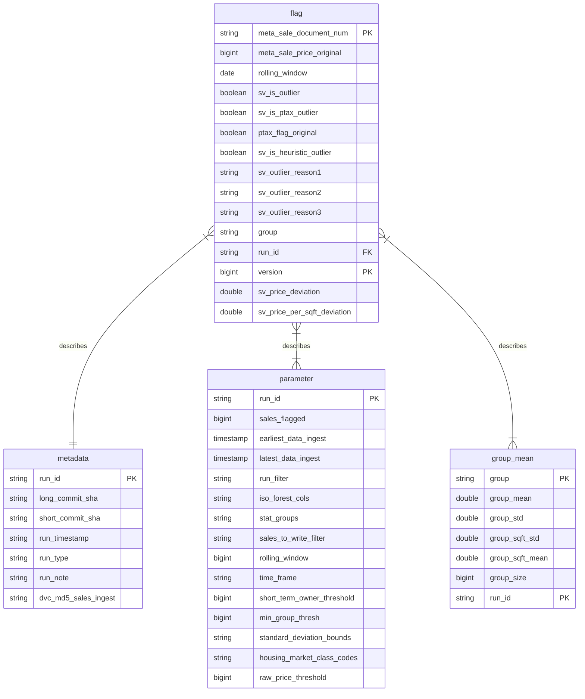

Table of Contents
=================

- [Model Overview](#model-overview)
- [What Gets Flagged](#what-gets-flagged)
- [Outlier Types](#outlier-types)
- [Flagging Details](#flagging-details)
- [Structure of Data](#structure-of-data)
- [Developing the sales val pipeline and testing changes](#developing-the-sales-val-pipeline-and-testing-changes)
- [AWS Glue Job Documentation](#aws-glue-job-documentation)
- [Exporting Flags to iasWorld](#exporting-flags-to-iasworld)

## Model Overview

This repository contains code to identify and flag sales that may be non-arms-length transactions. A non-arms-length sale occurs when the buyer and seller have a relationship that influences the transaction price, leading to a sale that doesn't reflect the true market value of the property.

The sales validation model (hereafter referred to as "the model") uses simple statistics and heuristics to identify such sales. For example, it calculates the standard deviation in (log) sale price by area and property type, then flags any sales beyond a certain number of standard deviations from the mean. It also uses a variety of common heuristics, such as matching last names, foreclosure information, etc.

Non-arms-length transactions can affect any process that uses sales data. As such, we currently use the output of this model to exclude flagged transactions from:

- The training data of our [valuation models](https://github.com/ccao-data/model-res-avm#model-overview)
- [Sales ratio statistics reports](https://www.cookcountyassessor.com/riverside-2023) produced by our valuation models

In the future, it is likely the flagging outputs from this model will be used further in public-facing ratio studies and reporting, as well as used internally by the office.

## What Gets Flagged

Sales from 2014 through present are flagged using this model. Ongoing sales are flagged on an ad-hoc basis as they are collected by the Department of Revenue and made available to the Data Department. See [Model run modes](#model-run-modes) for more information.

Commercial, industrial, and land-only property sales are _not_ flagged by this model. Residential and condominium sales are flagged with the following specifications:

**Residential**

- Includes classes:
  - 202, 203, 204, 205, 206, 207, 208, 209, 210, 211, 212, 218, 219, 234, 278, 295
- Excludes:
  - Multi-card sales

**Condos**

- Includes classes:
  - 297, 299, 399
- Excludes:
  - Parking spaces
  - Building common areas

**Common exclusions for both residential and condos**

- Excludes any sales with a duplicate price within 365 days
- Excludes sales less than $10,000
- Excludes multi-PIN sales

## Outlier Reasons

We generate up to 3 outlier reasons for any given sale. The columns are denoted as `sv_outlier_reason`, `sv_outlier_reason2`, and `sv_outlier_reason3`.
Sales can have a non-null `sv_outlier_reason` column and still _not_ be classified as an outlier.

`sv_is_outlier` is the column which tells us whether or not a sale is an outlier. The `sv_is_outlier` column is `True` only if one of the price outlier
reasons is assigned to the sale. These price reasons are generated by determining the number of standard deviations a property's sale price is away from 
the mean of similar properties. The other outlier reasons are purely supplementary information.

The following is a list of all current outlier reasons:

### 
| Indicator               | Description                                                     |
|-------------------------|---------------------------------------------------------------|
| High price                 | Sale price is a certain standard deviations above the mean of the sales in its statistical group           |
| Low price                  | Sale price is a certain standard deviations below the mean of the sales in its statistical group           |
| High price per square foot | Sale price per sqft is a certain standard deviations above the mean of the sales in its statistical group  |
| Low price per square foot  | Sale price per sqft is a certain standard deviations above the mean of the sales in its statistical groupy |
| Raw price threshoid        | Sale price is over a manually set threshold. Implemented to catch very expensive non-represenative homes   |
| PTAX - 203 Exclusion       |The [PTAX-203](https://tax.illinois.gov/content/dam/soi/en/web/tax/localgovernments/property/documents/ptax-203.pdf) form is required by the Illinois Department of Revenue for most property transfers. Certain fields on this form are highly indicative of a non-arms-length transaction, i.e. Question 10 indicating a short sale.  |
| Short-term owner           | The sale does not meet a given threshold for days since prior transaction                                  |
| Family sale                | Last name match between buyer and seller                                                                   |
| Non-person sale            | Flagged keyword suggests the sale involves a non-person legal entity (industrial buyer, bank, real estate firm, construction, etc.). |                                       |
| Statistical Anomaly        | Flagged via an unsupervised machine learning model (isolation forest).                                     |
| Price swing / Home flip    | Large swing away from mean + short-term owner                                                              |

## Flagging Details

### Model run modes

The model can be executed in three distinct run modes, depending on the state of the sales data and the specific requirements for flagging:

1. **Initial Flagging:** This mode is triggered when no sales have been flagged. It's the first step in the model to instantiate tables and flag sales. It's also useful to use this mode for quick development testing, as it has the least overhead.
2. **Manual Update:** This mode is used when sales need to be re-flagged, either due to errors or methodology updates. This allows for the selective re-flagging of sales. It also assigns flags to unflagged sales.
3. **Manual Update (New Sales Only):** This mode borrows much of the same logic as the normal 'Manual Update' mode, but is used
only to flag sales that do not have a current sales-val model determination. It will not re-flag any sales like the normal
'Manual Update' would.

```mermaid
graph TD
    subgraph "Manual Update Mode"
        A3{{"Sales must be re-flagged"}}
        B3{{"Set manual_update=True in src/inputs.yaml"}}
        C3[Run pipeline]
        D3[Increment version if sale already flagged]
        E3[Assign Version = 1 if sale unflagged]
        F3[Save results to S3 with new run ID]
        G3[Update flags in default.vw_pin_sale]


        A3 -->|Manual selection| B3
        B3 -->|Run update| C3
        C3 -->|Version check| D3
        D3 -->|Update process| F3
        C3 -->|New flag| E3
        E3 -->|Update process| F3
        F3 -->|Persist results| G3
    end

    subgraph "Manual Update (New Sales Only) Mode"
        A4{{"Flag only new sales"}}
        B4[Run pipeline]
        C4[Identify sales with no current model determination]
        E4[Assign Version = 1 if sale unflagged]
        F4[Save results to S3 with new run ID]
        G4[Update flags in default.vw_pin_sale]

        A4 -->|Filter new sales| B4
        B4 -->|Run update| C4
        C4 -->|New flag only| E4
        E4 -->|Update process| F4
        F4 -->|Persist results| G4
    end

    subgraph "Initial Run Mode"
        A1{{"No sales are flagged"}}
        B1[Run the pipeline]
        C1[Flag sales as outliers or non-outliers<br>with Version = 1]
        D1[Save results to S3 with unique run ID]
        E1[Join flags to<br>default.vw_pin_sale]


        A1 -->|Initial setup| B1
        B1 -->|Flag sales| C1
        C1 -->|Store flags| D1
        D1 -->|Persist results| E1
    end

    style A1 fill:#bbf,stroke:#333,stroke-width:2px,color:#000;
    style A4 fill:#bbf,stroke:#333,stroke-width:2px,color:#000;
    style A3 fill:#bbf,stroke:#333,stroke-width:2px,color:#000;
```



## Pipeline and DVC integration

### Pipeline stages
The pipeline is split up into 3 stages:
- `src/00_ingest.py` - This file queries the input data needed to run the pipeline
- `src/01_flag.py` - This file is where the flagging model runs and the flags are assigned.
- `src/02_upload.py` - This script grabs the output from `01_flag.py` and uploads them to S3, where athena will look to populate the relevant tables

### DVC integration

This repository
  uses DVC in 2 ways:
  1.  The input data is versioned, tracked, and
      stored using DVC. Previous input data sets are stored in
      perpetuity on S3.
  3.  [DVC
      pipelines](https://dvc.org/doc/user-guide/project-structure/pipelines-files)
      are used to sequentially run R pipeline scripts and track/cache
      inputs and outputs.


To pull all the necessary input data based on the information in
`dvc.lock`, run:

``` bash
dvc pull
```

To run the entire pipeline (excluding the export stage), run:

``` bash
dvc repro
```

Note that each stage will run only if necessary i.e. the ingest stage
will *not* run if no parameters (ins, outs, deps) related to that stage have changed. To
force a stage to re-run, run:

``` bash
# Change ingest to any stage name
dvc repro -f ingest
```

To force the entire pipeline to re-run, run:

``` bash
dvc repro -f
```

## Developing the sales val pipeline and testing changes

### Choose output target (in `src/inputs.yaml`)

```yaml
output_environment: "dev"  # or "prod"
```

- `"prod"` → writes to production tables & S3 paths
- `"dev"`: writes to user-scoped dev tables & S3 paths, athena database will appear as `z_dev_${USER}_sale`

### First-time dev setup
Once outputs arrive at the development S3 bucket, a crawler will need to be run to populate the Athena tables.

### Required environment variables

Ensure you have the following environment variables set:
- `AWS_S3_WAREHOUSE_BUCKET`
- `AWS_S3_WAREHOUSE_BUCKET_DEV`

## Structure of the output tables

All flagging runs populate 3 Athena tables with metadata, flag results, and other information. These tables can be used to determine _why_ an individual sale was flagged as an outlier. The structure of the tables is:



### Rolling window

The flagging model uses group means to determine the statistical deviation of sales, and flags them beyond a certain threshold. Group means are constructed using a rolling window strategy.

The current implementation uses a 12 month rolling window. This means that for any sale, the "group" contains all sales within the same month, along with all sales from the previous 11 months. This 12 month window can be changed by editing the configuration file: `src/inputs.yaml`. Additional notes on the rolling window implementation:

- We take every sale in the same month of the sale date, along with all sale data from the previous N months. This window contains roughly 1 year of data.
- This process starts with an `.explode()` call. Example [here](https://github.com/ccao-data/model-sales-val/blob/283a1403545019be135b4b9dbc67d86dabb278f4/glue/sales_val_flagging.py#L15).
- It ends by subsetting to the `original_observation` data. Example [here](https://github.com/ccao-data/model-sales-val/blob/499f9e31c92882312051837f35455d078d2507ee/glue/sales_val_flagging.py#L57).

## Exporting Flags to iasWorld

Use the `scripts/export.py` script to generate a CSV that can be uploaded to iasWorld to save new flags.

Example use:

```
python3 scripts/export.py > sales_val_flags.csv
```

The `sales_val_flags.csv` file can then be sent over for upload to iasWorld.
