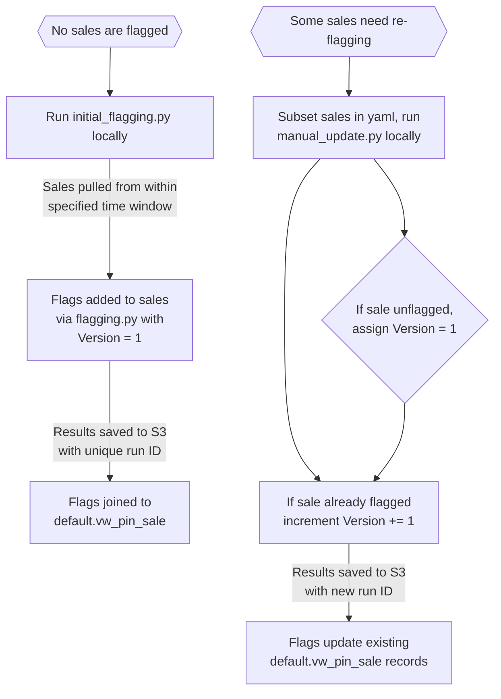
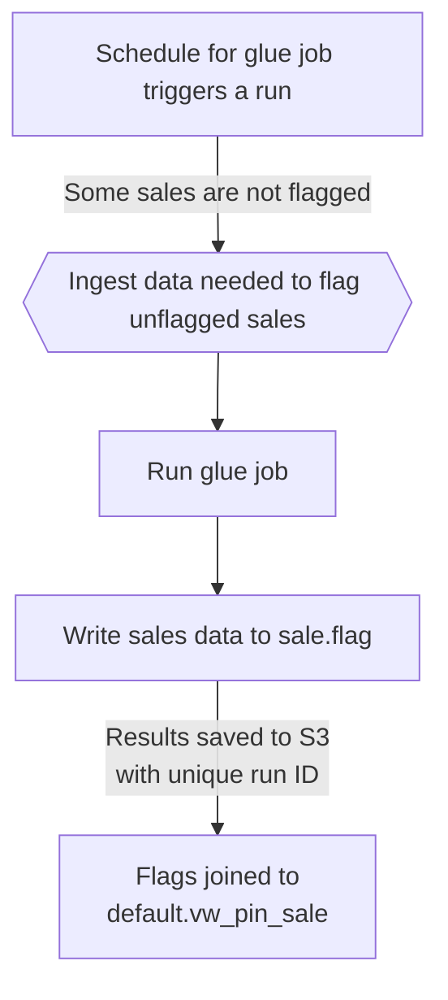
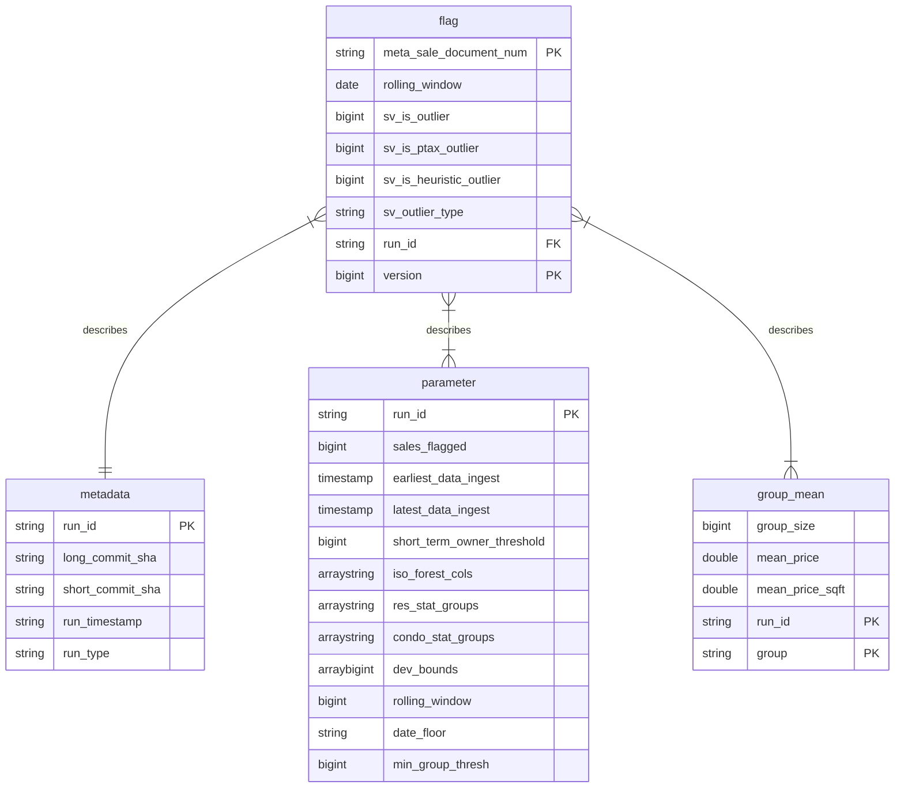
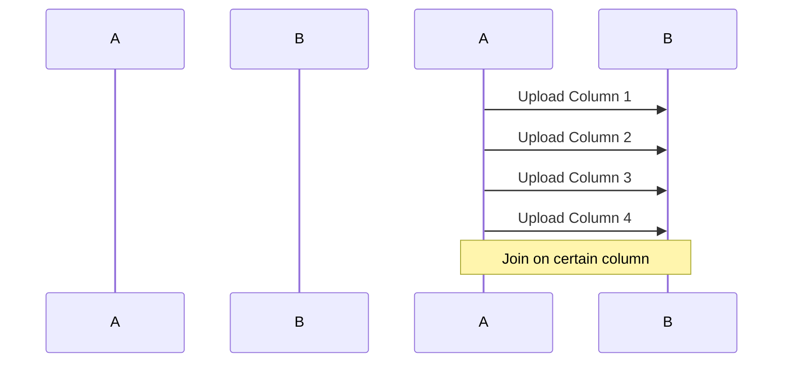
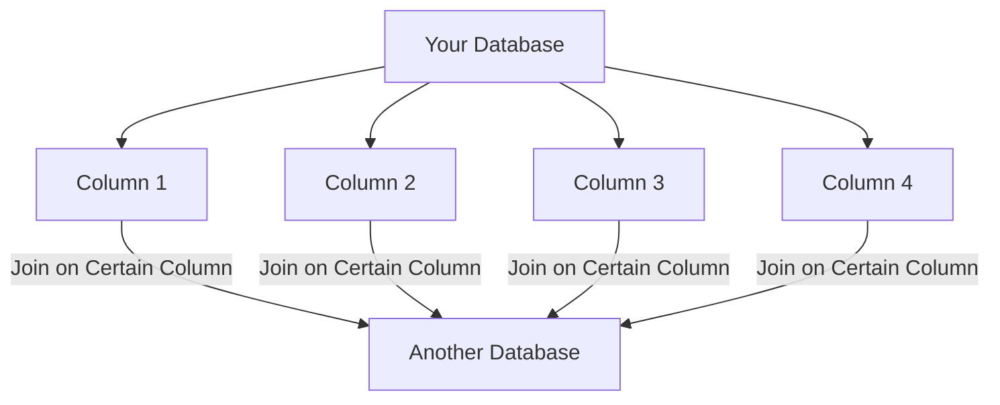

# Sales validation model (work in progress)

> :exclamation: IMPORTANT: This repo is under active development and is not yet in production.
>
> If an edit needs to made to anything in the `glue` directory, there is a specific process to be found [here](#aws-glue-job-documentation).

Table of Contents
================

- [Overview](#overview)
- [Flags at a Glance](#flags-at-a-glance)
- [Structure of data](#structure-of-data)
- [Important flagging details](#important-flagging-details)
- [AWS Glue job documentation](#aws-glue-job-documentation)
- [Next Steps](#next-steps)

# Overview

This repository contains code to identify and flag sales that may be non-arms-length transactions. A non-arms-length sale occurs when the buyer and seller have a relationship that might influence the transaction price, leading to a sale that doesn't reflect the true market value of the property. These sales can distort our analyses and models, since they don't adhere to the principle of an open and competitive market.

The workflow for sale flagging is as follows:

* A manual initial run of `manual_flagging/initial_flagging.py` instantiates all tables and flags all specified sales as either outliers or non-outliers.
* Next, `glue/sales_val_flagging.py` flags all new, unflagged sales. This script is automated such that it runs on a schedule (e.g. monthly).
* If an error occurs or we want to update the methodology on previously-flagged sales, `manual_flagging/manual_update.py` is used to select a subset of sales to re-flag. All sales have a version number that is incremented on update. When utilizing our sales views, we pull the flag data with the highest version value to keep it up-to-date.

#### Local Flagging
On the left, we see the normal workflow of the process. Represented on the right is the use of `manual_update.py` to update/re-flag sales.

#### Glue Job
And here we can see how the recurrent glue job will process unflagged sales:

# Flags at a Glance

Sales from 2014 - present have been processed using our sales validation program. We assign flags to the following classes of properties:

- **Residential** - 202, 203, 204, 205, 206, 207, 208, 209, 210, 211, 212, 218, 219, 234, 278, 295
- **Condos** - 297, 299, 399

## Outlier Types

In order to be flagged as on outlier type, the property needs to be a statistical price outlier. A statistical price outlier is a sale price that is some number of standard deviations outside a grouping of similar properties (eg. township, class, time frame).  However, there are also special flags that combine with the statistical outlier type, these sales *should* be more likely to be non-arms length sales than the regular price outlier sales. Examples of these special flags are:
- **PTAX flag**: The PTAX-203 form is required to be filled out for an Illinois Real Estate Transfer Declaration for non-residential property over $1 million and/or as required by Illinois Department of Revenue. If there are certain fields filled out on this form, we mark the sale with a ptax flag. 
- **Non-person sale**: We flag a keyword that suggests the sale involves a legal entity (industrial buyer, bank, real estate firm, construction, etc)
- **Flip Sale**: The owner of the home owned the property for less than 1 year
- **Anomaly**: Our isolation forest statistical outlier algorithm flagged the sale

The following is a list of all flag types.

### High Price

- **PTAX outlier (high)**: PTAX flag & [1 high statistical outlier type]
- **Home flip sale (high)**: Short-term owner < 1 year & [1 high statistical outlier type]
- **Family sale (high)**: Last name match & [1 high statistical outlier type]
- **Non-person sale (high)**: Legal / corporate entity + [1 high statistical outlier type]
- **Anomaly (High)**: Anomaly algorithm (high) & [1 high statistical outlier type]
- **High price (raw & sqft )**: High price & high price per sq. ft. 
- **High price swing**: Large swing away from mean  & high price outlier 
- **High price (raw)**: High price 
- **High price (per sqft)**: High price per sq. ft. 

### Low Price

- **PTAX outlier (high)**: PTAX flag & [1 low statistical outlier type]
- **Home flip sale (low)**: Short-term owner < 1 year & [1 low statistical outlier type]
- **Family sale (low)**: Last name match & [1 low statistical outlier type]
- **Non-person sale (low)**: Legal / corporate entity + [1 low statistical outlier type]
- **Anomaly**: - Anomaly algorithm (low) & [1 low statistical outlier type]
- **Low price (raw & sqft )**: Large swing away from mean & low price outlier 
- **Low price swing**: Low price & low price per sq. ft. 
- **Low price (raw)**: Low price (or under $10k)
- **Low price (per sqft)**: Low price per sq. ft.

## Distribution of Outlier Types

Around **4.5%** of the total sales have some sort of `Outlier` classification. Within that 4.5% the makeup of the outlier distribution is approximately as follows:

|Outlier Type           |Proportion            |
|-----------------------|----------------------|
|PTAX-203 flag          |0.5789                |
|Anomaly (high)         |0.0865                |
|High price (raw)       |0.0865                |
|Non-person sale (high) |0.0479                |
|Non-person sale (low)  |0.032                 |
|Low price (raw & sqft) |0.032                 |
|High price (sqft)      |0.0283                |
|High price (raw & sqft)|0.0256                |
|Home flip sale (high)  |0.0249                |
|Low price (sqft)       |0.0229                |
|Low price (raw)        |0.0182                |
|Anomaly (low)          |0.0082                |
|Home flip sale (low)   |0.0042                |
|Family sale (low)      |0.0033                |
|Family sale (high)     |5.0E-4                |
|Low price swing        |0.0                   |

# Structure of data

All flagging runs populate 3 Athena tables with metadata, flag results, and other information. These tables can be used to determine _why_ an individual sale was flagged as an outlier. The structure of the tables is:

# Important flagging details

### Rolling window

The flagging model uses group means to determine the statistical deviation of sales, and flags them beyond a certain threshold. Group means are constructed using a rolling window strategy.

The current implementation uses a 12 month rolling window. This means that for any sale, the "group" contains all sales within the same month, along with all sales from the previous 11 months. This 12 month window can be changed by editing the config files: `manual_flagging/yaml/` and `main.tf`. Additional notes on the rolling window implementation:

- We take every sale in the same month of the sale date, along with all sale data from the previous N months. This window contains roughly 1 year of data.
- This process starts with an `.explode()` call. Example [here](https://github.com/ccao-data/model-sales-val/blob/283a1403545019be135b4b9dbc67d86dabb278f4/glue/sales_val_flagging.py#L15).
- It ends by subsetting to the `original_observation` data. Example [here](https://github.com/ccao-data/model-sales-val/blob/499f9e31c92882312051837f35455d078d2507ee/glue/sales_val_flagging.py#L57).
- Corresponding functions in [Mansueto](https://miurban.uchicago.edu/)'s flagging model accommodate this rolling window integration, these functions are defined `glue/flagging_script_glue/flagging.py`.

# AWS Glue job documentation

This repository manages the configurations, scripts, and details for an AWS Glue Job. It's essential to maintain consistency and version control for all changes related to the job. Therefore, specific procedures have been established.

## ⚠️ Important guidelines

1. **DO NOT** modify the Glue job script, its associated flagging python script, or any of its job details directly via the AWS Console.
2. All changes to these components should originate from this repository. This ensures that every modification is tracked and version-controlled.
3. The **only** advisable actions in the AWS Console concerning this Glue job are:
    - Running the job
4. To test a change to the Glue job script or the flagging script, make an edit on a branch and open a pull request. Our GitHub Actions configuration will deploy a staging version of your job, named `ci_<your-branch-name>_sales_val_flagging`, that you can run to test your changes. See the [Modifying the Glue job](#modifying-the-glue-job-its-flagging-script-or-its-settings) section below for more details.

## Modifying the Glue job, its flagging script, or its settings

The Glue job and its flagging script are written in Python, while the job details and settings are defined in a [Terraform](https://developer.hashicorp.com/terraform/intro) configuration file. These files can be edited to modify the Glue job script, its flagging script, or its job settings.

1. Locate the desired files to edit:
    - Glue script: `glue/sales_val_flagging.py`
    - Flagging script: `glue/flagging_script_glue/flagging.py`
    - Job details/settings: `main.tf`, under the resource block `aws_glue_job.sales_val_flagging` (see [the Terraform AWS provider docs](https://registry.terraform.io/providers/hashicorp/aws/latest/docs/resources/glue_job) for details)
2. Any changes to these files should be made in the following sequence:
    - Make a new git branch for your changes.
    - Edit the files as necessary.
    - Open a pull request for your changes against the `main` branch. A GitHub Actions workflow called `deploy-terraform` will deploy a staging version of your job named `ci_<your-branch-name>_sales_val_flagging` that you can run to test your changes.
      - By default, this configuration will deploy an empty version of the `sale.flag` table, which simulates an environment in which there are no preexisting flags prior to a run.
      - If you would like to test your job against a subset of the production data, copy your data subset from the production job bucket to the bucket created by Terraform for your job (or leave the new bucket empty to simulate running the job when no flags exist). Then, run the crawler created by Terraform for your PR in order to populate the staging version of the `sale.flag` database that your staging job uses. If you're having trouble finding your staging bucket, job, or crawler, check the GitHub Actions output for the first successful run of your PR and look for the Terraform output displaying the IDs of these resources.
    - If you need to make further changes, push commits to your branch and GitHub Actions will deploy the changes to the staging job and its associated resources.
    - Once you're happy with your changes, request review on your PR.
    - Once your PR is approved, merge it into `main`. A GitHub Actions workflow called `cleanup-terraform` will delete the staging resources that were created for your branch, while a separate `deploy-terraform` run will deploy your changes to the production job and its associated resources.
  
# Next steps

## iasWorld Integration

We plan to integrate this data into our iasWorld database, so that these flags are widely available in the CCAO. We plan to upload 4-5 columns:
- Is non-arms-length (boolean)
- Flag reason (text)
- Flag run ID (hidden)
- Analyst override (boolean)
- (Tentatively) Date of review (date)

## Analyst Review

In the future, it is our goal that human sales validation analysts will be able to review these flags and manually override them. In the longer-term future we could train a supervised model using the analysts' judgement.

