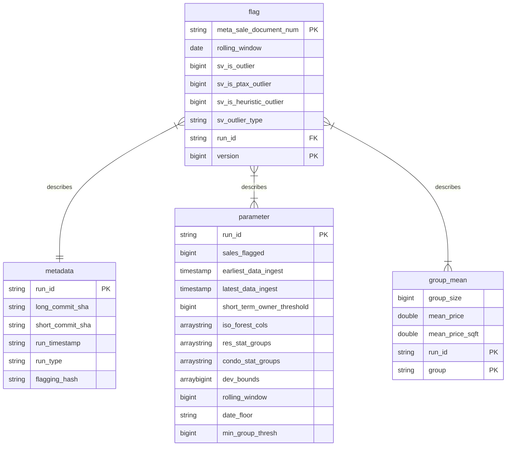

# Sales validation model (work in progress)

> :exclamation: IMPORTANT: This repo is under active development and is not yet in production.
>
> If an edit needs to made to anything in the `glue` directory, there is a specific process to be found [here](#aws-glue-job-documentation).

Table of Contents
================

- [Overview](#overview)
- [Structure of data](#structure-of-data)
- [Important flagging details](#important-flagging-details)
- [AWS Glue job documentation](#aws-glue-job-documentation)

# Overview

This repository contains code to identify and flag sales that may be non-arms-length transactions. A non-arms-length sale occurs when the buyer and seller have a relationship that might influence the transaction price, leading to a sale that doesn't reflect the true market value of the property. These sales can distort our analyses and models, since they don't adhere to the principle of an open and competitive market.

The workflow for sale flagging is as follows:

* A manual initial run of `manual_flagging/initial_flagging.py` instantiates all tables and flags all specified sales as either outliers or non-outliers.
* Next, `glue/sales_val_flagging.py` flags all new, unflagged sales. This script is automated such that it runs on a schedule (e.g. monthly).
* If an error occurs or we want to update the methodology on previously-flagged sales, `manual_flagging/manual_update.py` is used to select a subset of sales to re-flag. All sales have a version number that is incremented on update. When utilizing our sales views, we pull the flag data with the highest version value to keep it up-to-date.

On the left, we see the normal workflow of the process. Represented on the right is the use of `manual_update.py` to update/re-flag sales.

# Structure of data

All flagging runs populate 3 Athena tables with metadata, flag results, and other information. These tables can be used to determine _why_ an individual sale was flagged as an outlier. The structure of the tables is:

# Important flagging details

### Rolling Window

The flagging model uses group means to determine the statistical deviation of sales, and flags them beyond a certain threshold. Group means are constructed using a rolling window strategy.

The current implementation uses a 12 month rolling window. This means that for any sale, the "group" contains all sales within the same month, along with all sales from the previous 11 months. This 12 month window can be changed by editing the config files: `manual_flagging/yaml/` and `glue/sales_val_flagging.json`. Additional notes on the rolling window implementation:

- We take every sale in the same month of the sale date, along with all sale data from the previous N months. This window contains roughly 1 year of data.
- This process starts with an `.explode()` call. Example [here](https://github.com/ccao-data/model-sales-val/blob/283a1403545019be135b4b9dbc67d86dabb278f4/glue/sales_val_flagging.py#L15).
- It ends by subsetting to the `original_observation` data. Example [here](https://github.com/ccao-data/model-sales-val/blob/499f9e31c92882312051837f35455d078d2507ee/glue/sales_val_flagging.py#L57).
- Corresponding functions in [Mansueto](https://miurban.uchicago.edu/)'s flagging model accommodate this rolling window integration, these functions are defined in each of the flagging functions, one in `manual_flagging/src/flagging_rolling.py`, and one for the Glue job in `glue/flagging_script_glue/*.py`.

# AWS Glue job documentation

This repository manages the configurations, scripts, and details for an AWS Glue Job. It's essential to maintain consistency and version control for all changes related to the job. Therefore, specific procedures have been established.

## ⚠️ Important Guidelines

1. **DO NOT** modify the Glue job script, its associated flagging python script, or any of its job details directly via the AWS Console.
2. All changes to these components should originate from this repository. This ensures that every modification is tracked and version-controlled.
3. The **only** advisable actions in the AWS Console concerning this Glue job are:
    - Running the job
    - Pulling updates from the repo through AWS's version control system.

## Modifying the Glue Job Script or Details

1. Locate the desired files:
    - Glue script: `glue/sales_val_flagging.py`
    - Job details/settings: `glue/sales_val_flagging.json`
2. Any changes to these files should be made in the following sequence:
    - Push modifications to the master branch of this repo.
    - Pull these changes from the AWS Console.

    > Note: AWS Glue is integrated with GitHub for version control. Ensure you have the necessary authentication. If required, use a personal access token. See [this guide](https://aws.amazon.com/blogs/big-data/code-versioning-using-aws-glue-studio-and-github/) for more details. Make these changes from the `Version Control` tab of the AWS Glue job.

## Modifying the S3 Flagging Script

The S3 flagging script `glue/flagging_script_glue/flagging_<hash>.py` is uniquely identified through a hash. This helps in tracking changes efficiently.

### How Hashing Works:

- The script name will include the first 6 characters of its hash.
- Upon execucution of a glue job, these characters are then logged in the `sale.metadata` table in Athena.
- This enables us to track and locate any flagging file used by the Glue script, matching the commit hash and the flagging file within `glue/flagging_script_glue/`.

The hashing process utilizes the bash script `glue/flagging_script_glue/hash.sh`.

### Steps to Modify the S3 Flagging Script:

1. Edit file: `glue/flagging_script_glue/hash.sh`
2. Save your changes locally.
3. Run the `hash.sh` script. This action:
    - Rehashes the updated file.
    - Renames the file, appending the first 6 characters of the new hash.
    - Removes the previously hashed flagging file.
4. The updated hash file should reflect in both the S3 bucket and this repository.
5. Push the changes to the master branch.

