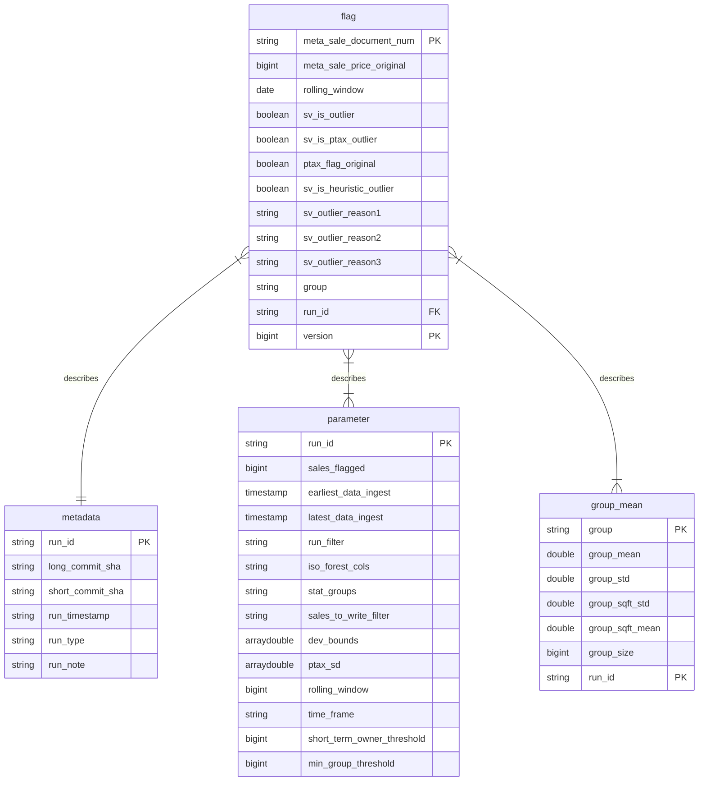

Table of Contents
=================

- [Model Overview](#model-overview)
- [What Gets Flagged](#what-gets-flagged)
- [Outlier Types](#outlier-types)
- [Flagging Details](#flagging-details)
- [Structure of Data](#structure-of-data)
- [AWS Glue Job Documentation](#aws-glue-job-documentation)
- [Exporting Flags to iasWorld](#exporting-flags-to-iasworld)

## Model Overview

This repository contains code to identify and flag sales that may be non-arms-length transactions. A non-arms-length sale occurs when the buyer and seller have a relationship that influences the transaction price, leading to a sale that doesn't reflect the true market value of the property.

The sales validation model (hereafter referred to as "the model") uses simple statistics and heuristics to identify such sales. For example, it calculates the standard deviation in (log) sale price by area and property type, then flags any sales beyond a certain number of standard deviations from the mean. It also uses a variety of common heuristics, such as matching last names, foreclosure information, etc.

Non-arms-length transactions can affect any process that uses sales data. As such, we currently use the output of this model to exclude flagged transactions from:

- The training data of our [valuation models](https://github.com/ccao-data/model-res-avm#model-overview)
- [Sales ratio statistics reports](https://www.cookcountyassessor.com/riverside-2023) produced by our valuation models

In the future, it is likely the flagging outputs from this model will be used further in public-facing ratio studies and reporting, as well as used internally by the office.

## What Gets Flagged

Sales from 2014 through present are flagged using this model. Ongoing sales are flagged on an ad-hoc basis as they are collected by the Department of Revenue and made available to the Data Department. See [Model run modes](#model-run-modes) for more information.

Commercial, industrial, and land-only property sales are _not_ flagged by this model. Residential and condominium sales are flagged with the following specifications:

**Residential**

- Includes classes:
  - 202, 203, 204, 205, 206, 207, 208, 209, 210, 211, 212, 218, 219, 234, 278, 295
- Excludes:
  - Multi-card sales

**Condos**

- Includes classes:
  - 297, 299, 399
- Excludes:
  - Parking spaces
  - Building common areas

**Common exclusions for both residential and condos**

- Excludes any sales with a duplicate price within 365 days
- Excludes sales less than $10,000
- Excludes multi-PIN sales

## Outlier Types

Outlier flags are broken out into 2 types: statistical outliers and heuristic outliers.

- Statistical outliers are sales that are a set number of standard deviations (usually 2) away from the mean of a group of similar properties (e.g. within the same township, class, timeframe, etc.).
- Heuristic outliers use some sort of existing flag or rule to identify potentially non-arms-length sales. Heuristic outliers are _**always combined with a statistical threshold**_, i.e. a sale with a matching last name must _also_ be N standard deviations from a group mean in order to be flagged. Examples of heuristic outlier flags include:
  - **PTAX flag**: The [PTAX-203](https://tax.illinois.gov/content/dam/soi/en/web/tax/localgovernments/property/documents/ptax-203.pdf) form is required by the Illinois Department of Revenue for most property transfers. Certain fields on this form are highly indicative of a non-arms-length transaction, i.e. Question 10 indicating a short sale.
  - **Non-person sale**: Flagged keyword suggests the sale involves a non-person legal entity (industrial buyer, bank, real estate firm, construction, etc.).
  - **Flip Sale**: Flagged when the owner of the home owned the property for less than 1 year
  - **Anomaly**: Flagged via an unsupervised machine learning model (isolation forest).

The following is a list of all current flag types:

### High Price

| Indicator               | Criteria                                                      |
|-------------------------|---------------------------------------------------------------|
| PTAX outlier (high)     | PTAX flag & [1 high statistical outlier type]                 |
| Home flip sale (high)   | Short-term owner < 1 year & [1 high statistical outlier type] |
| Family sale (high)      | Last name match & [1 high statistical outlier type]           |
| Non-person sale (high)  | Legal / corporate entity & [1 high statistical outlier type]  |
| Anomaly (High)          | Anomaly algorithm (high) & [1 high statistical outlier type]  |
| High price (raw & sqft) | High price & high price per sq. ft.                           |
| High price swing        | Large swing away from mean & high price outlier               |
| High price (raw)        | High price                                                    |
| High price (per sqft)   | High price per sq. ft.                                        |

### Low Price

| Indicator               | Criteria                                                      |
|-------------------------|---------------------------------------------------------------|
| PTAX outlier (low)      | PTAX flag & [1 low statistical outlier type]                  |
| Home flip sale (low)    | Short-term owner < 1 year & [1 low statistical outlier type]  |
| Family sale (low)       | Last name match & [1 low statistical outlier type]            |
| Non-person sale (low)   | Legal / corporate entity & [1 low statistical outlier type]   |
| Anomaly                 | Anomaly algorithm (low) & [1 low statistical outlier type]    |
| Low price (raw & sqft)  | Low price & low price per sq. ft.                             |
| Low price swing         | Large swing away from mean & low price outlier                |
| Low price (raw)         | Low price (or under $10k)                                     |
| Low price (per sqft)    | Low price per sq. ft.                                         |

### Distribution of Outlier Types

<!--
/*
This query is used to generate the total sales that have some sort of outlier classification
/*

-->

As of 2024-03-15, around **6.9%** of the total sales have some sort of outlier classification. Within that 6.9%, the proportion of each outlier type is:

<!--
/*
This query is used to generate the proportion of different outlier types
/*
-->

## Flagging Details

### Model run modes

The model can be executed in three distinct run modes, depending on the state of the sales data and the specific requirements for flagging:

1. **Initial Run:** This mode is triggered when no sales have been flagged. It's the first step in the model to instantiate tables and flag sales.
2. **Manual Update:** This mode is used when sales need to be re-flagged, either due to errors or methodology updates. This allows for the selective re-flagging of sales. It also assigns flags to unflagged sales.
3. **Manual Update (New Sales Only):** This mode borrows much of the same logic as the normal 'Manual Update' mode, but is used
only to flag sales that do not have a current sales-val model determination. It will not re-flag any sales like the normal
'Manual Update' would.

| Aspect                          | Manual Update                               | Manual Update (New Sales Only)             |
|---------------------------------|----------------------------------------------|---------------------------------------------|
| Primary Use                     | Re-flagging sales due to errors or changes in methodology | Flagging only new sales that lack a current sales-val model determination |
| Re-Flag Existing Sales          | Yes, existing flagged sales can be re-flagged | No, does not re-flag already flagged sales  |
| Flags Unflagged Sales           | Yes                                          | Yes, but only if they are new and currently unflagged |

```mermaid
graph TD
    subgraph "Manual Update Mode"
        A3{{Sales must be re-flagged}}
        B3[Specify subset in YAML file]
        C3[Run manual_update.py standard mode]
        D3[Check if sale already flagged]
        E3[If flagged: Increment version]
        F3[If unflagged: Assign Version = 1]
        G3[Update flags in default.vw_pin_sale]
        H3[Save results to S3 with new run ID]

        A3 -->|Manual selection| B3
        B3 -->|Run update| C3
        C3 --> D3
        D3 -->|Flagged| E3 --> G3
        D3 -->|Unflagged| F3 --> G3
        G3 -->|Persist results| H3
    end

    subgraph "Manual Update (New Sales Only) Mode"
        A4{{Flag only new unflagged sales}}
        B4[Specify subset in YAML file new only]
        C4[Run manual_update.py new-sales-only mode]
        D4[Check if sale already flagged]
        E4[If unflagged: Assign Version = 1]
        F4[If flagged: Skip]
        G4[Update flags in default.vw_pin_sale new only]
        H4[Save results to S3 with new run ID]

        A4 -->|Manual selection| B4
        B4 -->|Run update (new-only)| C4
        C4 --> D4
        D4 -->|Flagged| F4
        D4 -->|Unflagged| E4 --> G4
        G4 -->|Persist results| H4
    end

    subgraph "Initial Run Mode"
        A1{{"No sales are flagged"}}
        B1[Run initial_flagging.py]
        C1[Flag sales as outliers or non-outliers<br>with Version = 1]
        D1[Join flags to<br>default.vw_pin_sale]
        E1[Save results to S3 with unique run ID]

        A1 -->|Initial setup| B1
        B1 -->|Flag sales| C1
        C1 -->|Store flags| D1
        D1 -->|Persist results| E1
    end

    style A1 fill:#bbf,stroke:#333,stroke-width:2px,color:#000;
    style B2 fill:#bbf,stroke:#333,stroke-width:2px,color:#000;
    style A3 fill:#bbf,stroke:#333,stroke-width:2px,color:#000;
```

### Rolling window

The flagging model uses group means to determine the statistical deviation of sales, and flags them beyond a certain threshold. Group means are constructed using a rolling window strategy.

The current implementation uses a 12 month rolling window. This means that for any sale, the "group" contains all sales within the same month, along with all sales from the previous 11 months. This 12 month window can be changed by editing the configuration files: `manual_flagging/yaml/` and `main.tf`. Additional notes on the rolling window implementation:

- We take every sale in the same month of the sale date, along with all sale data from the previous N months. This window contains roughly 1 year of data.
- This process starts with an `.explode()` call. Example [here](https://github.com/ccao-data/model-sales-val/blob/283a1403545019be135b4b9dbc67d86dabb278f4/glue/sales_val_flagging.py#L15).
- It ends by subsetting to the `original_observation` data. Example [here](https://github.com/ccao-data/model-sales-val/blob/499f9e31c92882312051837f35455d078d2507ee/glue/sales_val_flagging.py#L57).

## Structure of Data

All flagging runs populate 3 Athena tables with metadata, flag results, and other information. These tables can be used to determine _why_ an individual sale was flagged as an outlier. The structure of the tables is:



## AWS Glue Job Documentation

This repository manages the configurations, scripts, and details for an AWS Glue Job. It's essential to maintain consistency and version control for all changes related to the job. Therefore, specific procedures have been established.

### ⚠️ Important guidelines

1. **DO NOT** modify the Glue job script, its associated flagging python script, or any of its job details directly via the AWS Console.
2. All changes to these components should originate from this repository. This ensures that every modification is tracked and version-controlled.
3. The **only** advisable actions in the AWS Console concerning this Glue job are:
    - Running the job
4. To test a change to the Glue job script or the flagging script, make an edit on a branch and open a pull request. Our GitHub Actions configuration will deploy a staging version of your job, named `z_ci_<your-branch-name>_sales_val_flagging`, that you can run to test your changes. See the [Modifying the Glue job](#modifying-the-glue-job-its-flagging-script-or-its-settings) section below for more details.

### Modifying the Glue job, its flagging script, or its settings

The Glue job and its flagging script are written in Python, while the job details and settings are defined in a [Terraform](https://developer.hashicorp.com/terraform/intro) configuration file. These files can be edited to modify the Glue job script, its flagging script, or its job settings.

1. Locate the desired files to edit:
    - Glue script: `glue/sales_val_flagging.py`
    - Flagging script: `glue/flagging_script_glue/flagging.py`
    - Job details/settings: `main.tf`, under the resource block `aws_glue_job.sales_val_flagging` (see [the Terraform AWS provider docs](https://registry.terraform.io/providers/hashicorp/aws/latest/docs/resources/glue_job) for details)
2. Any changes to these files should be made in the following sequence:
    - Make a new git branch for your changes.
    - Edit the files as necessary.
    - Open a pull request for your changes against the `main` branch. A GitHub Actions workflow called `deploy-terraform` will deploy a staging version of your job named `z_ci_<your-branch-name>_sales_val_flagging` that you can run to test your changes.
      - By default, this configuration will deploy an empty version of the `sale.flag` table, which simulates an environment in which there are no preexisting flags prior to a run.
      - If you would like to test your job against a subset of the production data, copy your data subset from the production job bucket to the bucket created by Terraform for your job (or leave the new bucket empty to simulate running the job when no flags exist). Then, run the crawler created by Terraform for your PR in order to populate the staging version of the `sale.flag` database that your staging job uses. If you're having trouble finding your staging bucket, job, or crawler, check the GitHub Actions output for the first successful run of your PR and look for the Terraform output displaying the IDs of these resources.
    - If you need to make further changes, push commits to your branch and GitHub Actions will deploy the changes to the staging job and its associated resources.
    - Once you're happy with your changes, request review on your PR.
    - Once your PR is approved, merge it into `main`. A GitHub Actions workflow called `cleanup-terraform` will delete the staging resources that were created for your branch, while a separate `deploy-terraform` run will deploy your changes to the production job and its associated resources.

## Exporting Flags to iasWorld

Use the `scripts/export.py` script to generate a CSV that can be uploaded to iasWorld to save new flags.

Example use:

```
python3 scripts/export.py > sales_val_flags.csv
```

The `sales_val_flags.csv` file can then be sent over for upload to iasWorld.
